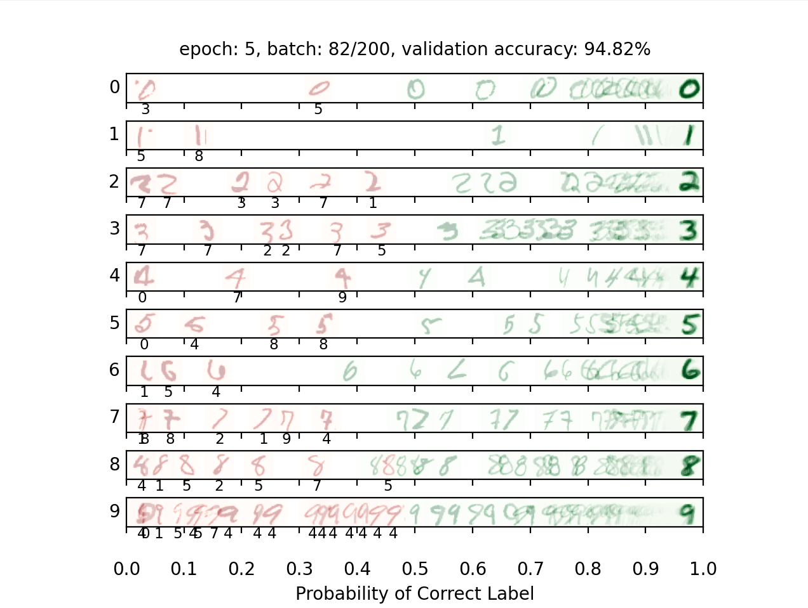

# Neural Networks from First Principles

A compact machine-learning project that explores how learning algorithms are built and trained without a high-level framework. The project progresses from a binary perceptron to fully connected neural networks for nonlinear regression and handwritten-digit recognition, all powered by a lightweight NumPy computation graph.

Developed as a three-person course project for CISC 352 (Artificial Intelligence).

## Highlights

- Trains a perceptron to convergence on linearly separable data.
- Approximates `sin(x)` on the interval `[-2pi, 2pi]` with a two-layer neural network.
- Classifies MNIST digits with a 784-300-10 multilayer perceptron.
- Uses mini-batch gradient descent, ReLU activations, softmax cross-entropy, and squared-error loss.
- Includes reverse-mode automatic differentiation over a small computation graph.
- Monitors validation accuracy and visualizes model confidence during training.

## Model overview

| Model | Task | Architecture | Objective |
| --- | --- | --- | --- |
| Perceptron | Binary classification | Single learned weight vector | Perceptron update rule; trains until a mistake-free pass |
| Regression network | Nonlinear function approximation | 1 -> 300 -> 1 | Mini-batch gradient descent with squared loss |
| Digit classifier | 10-class MNIST recognition | 784 -> 300 -> 10 | Mini-batch gradient descent with softmax loss |

The MNIST trainer checks validation accuracy after each epoch and targets at least 97.7% before stopping. The included evaluator independently checks for at least 97% test accuracy.

## Training visualization

The digit-classification dashboard sorts samples by the model's confidence in the correct label. Green images are classified correctly, while red images show mistakes and the predicted class. This snapshot captures an intermediate epoch during training.



## How it works

Each model builds a computation graph from reusable operations such as matrix multiplication, bias addition, ReLU, and loss functions. A reverse traversal of that graph applies the chain rule to compute parameter gradients. The training loops then update weights directly with mini-batch gradient descent.

This makes the learning pipeline visible end to end:

```text
input batch -> forward pass -> loss -> backpropagation -> parameter update
```

Unlike projects centered on a prebuilt training API, the implementation exposes tensor shapes, parameter updates, loss construction, batching, and stopping criteria directly.

## Getting started

### Requirements

- Python 3
- NumPy
- Matplotlib

Create a virtual environment and install the dependencies:

```bash
python -m venv .venv
```

On macOS or Linux:

```bash
source .venv/bin/activate
pip install numpy matplotlib
```

On Windows PowerShell:

```powershell
.venv\Scripts\Activate.ps1
pip install numpy matplotlib
```

### Run the evaluator

Run all public checks without opening visualization windows:

```bash
python autograder.py --no-graphics
```

Run an individual model check:

```bash
python autograder.py --no-graphics -q q1  # perceptron
python autograder.py --no-graphics -q q2  # regression
python autograder.py --no-graphics -q q3  # digit classification
```

Training the regression and MNIST models can take several minutes because the networks run entirely through the educational NumPy engine.

## Repository structure

```text
.
|-- models.py       # Model architectures, forward passes, and training loops
|-- nn.py           # Computation-graph nodes and automatic differentiation
|-- backend.py      # Datasets, batching, validation, and visualizations
|-- autograder.py   # Public correctness and performance checks
`-- data/
    |-- mnist.npz   # Handwritten-digit dataset
    `-- Q3_output.png
```

## Team project

This project was completed collaboratively by a team of three. The repository reflects the integrated team submission: model design, training behavior, debugging, and evaluation were developed and validated together.

## Technical stack

Python | NumPy | Matplotlib | Neural Networks | Automatic Differentiation | Gradient Descent | MNIST
